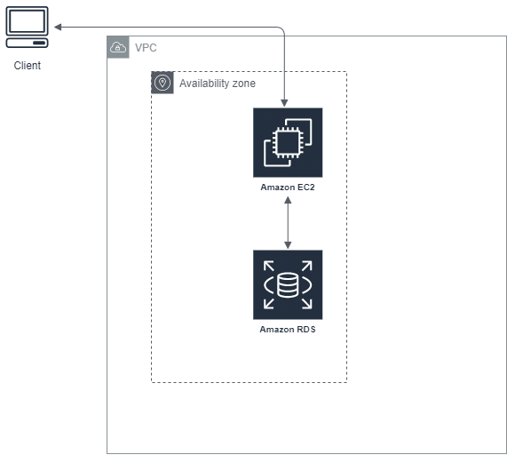

## 再学習！AWS のメリット

### 問 1

以下は AWS のコストに関する説明文である。
(A)から(D)までが何かを回答してください。

```
AWSは「(A)」がかからない。
AWSの料金体系は「(B)」がベースになっているため、ITリソースの費用が固定費にならない。
※ベースと記載しているのは、長期利用で割引を享受する「(C)」や
使用量を約束したうえで割引を享受する「(D)」もあるためである。
```

---

### 問 2

AWS は 2006 年のサービス開始以降、継続的な値下げが行われている。  
なぜ値下げが継続的に行われるかを以下の語群を用いて説明してください。

-   技術の革新
-   顧客の増加
-   値下げ
-   資本・技術投資

---

### 問 3

AWS では柔軟にサーバの台数や増減させたり、サーバのスペックを変更できる。  
これは「必要な時にすぐに必要な IT リソースを調達できる(サーバダウンによる機会損失を減らす)」「余剰コストを生まない」という観点で オンプレミスに比べた場合のメリットといえる。  
以下のどれかを例にこのメリットを説明してください。

-   「入学試験の合格発表」
-   「テレビショッピング」
-   「企業の基幹システム」

---

### 問 4

以下はオンプレミスの環境での事例である。

```
データベースのソフトウェアのEOLが迫っていたため、 バージョンアップを実施した。
本番環境とテスト用環境のサーバのスペックやデータ量は大きく異なっていたが、テスト用環境でSQLの構文エラーや性能の大幅な劣化が見られなかった。
本番環境のデータベースをバージョンアップしたところ、いくつかのバッチが長時間化が露見した。
```

こうした事例を極力減らすために、AWS でできることを説明してください。

---

### 問 5

以下、(1)(2)が何かを答えてください。

(1) 複数のデータセンターの集合体。AWS の専用線で接続されている。耐障害性に貢献。
(2) 複数の(1)から構成される。

---

### 問 6

以下はアプリケーションサーバと RDS が接続されているインフラ構成である、改善点をあげてください。



---

### 問 7

S3 で静的コンテンツを管理している Web サイトがある。  
近々、この Web サイトは世界中に配信することを考えている。  
遅延なく配信するための機能が何かを答えてください。

---

### 問 8

「疎結合」「密結合」を「郵便」に例えて説明してください。

---

### 問 9

AWS ではサーバの管理をせず、開発をそのものに専念できるという  
メリットを持つ特徴「サーバレス」を有している機能の利用を推奨している。
コンピューティングの分野(コードをサーバの管理なしに実現)・ストレージの分野で代表的な機能を 1 つずつあげてください。

---

### 問 10

AWS の責任共有モデルについて説明してください。

---

### 問 11

AWS のサポートは「ベーシック」「開発者」「ビジネス」「エンタープライズ」の 4 段階で構成される。(左から低い順に記載)

「ビジネス」「エンタープライズ」では、とある機能をフルに利用することができる。
機能名を解答してください。

---
