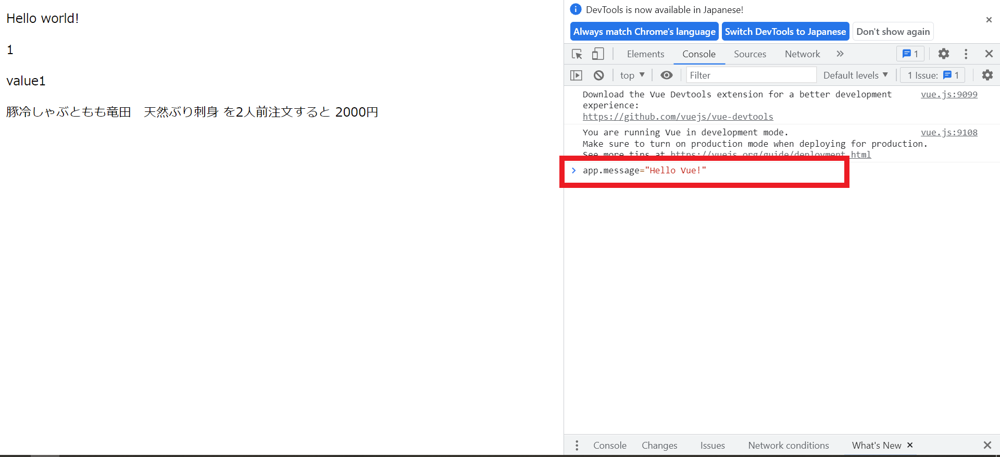
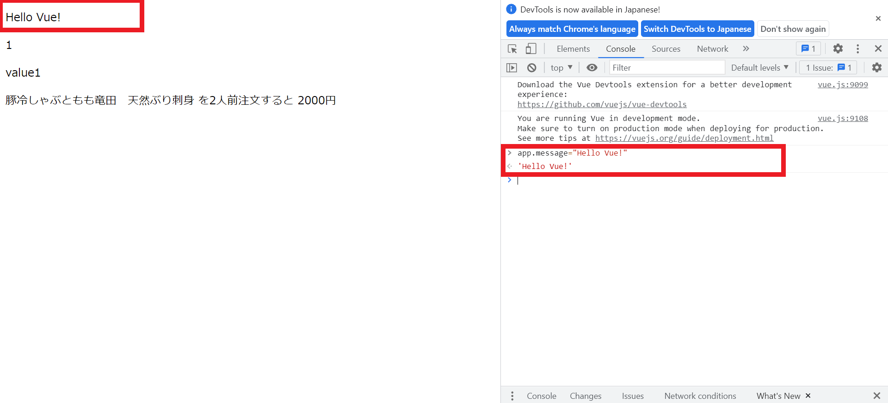
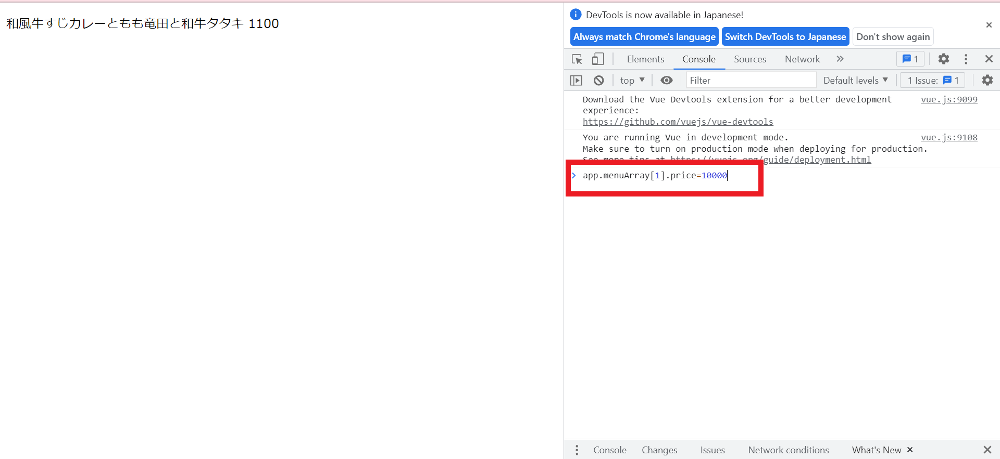
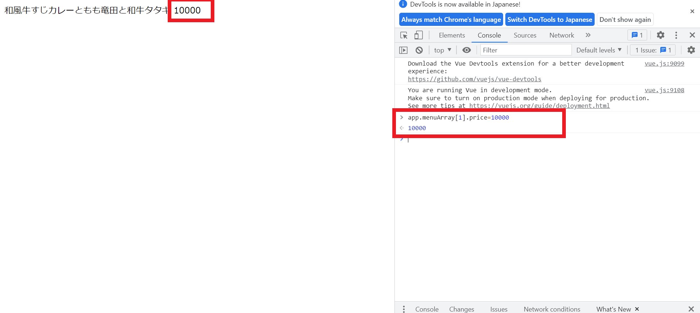

# テンプレート構文　補足

## Vue インスタンスの値を Chrome 開発者ツールから変更する

-   Chrome で開発者ツールを開く
-   `Console`タブを開く
-   タブ内の入力 UI に対して変更したい変数名を入力
    -   `Vue インスタンスの変数名(グローバルで宣言されているもの).変更したいプロパティ名`
        -   `data`は不要なので注意！
-   式の右辺に値を入力
    
-   Enter を押下すると、data 属性に変更が反映される(その結果、画面(View 側)に即時反映される)
    

### 変更したい値が配列の要素の場合

開発者ツールの使い方的なところは同じ。  
変更する対象の指定が少し異なる。  
変更したい要素を配列のインデックスを指定する。

### 補足

コンソール上で上下キーを押すと、実行したコマンドの履歴を遡ることができる。  
似たようなコマンドを実行したい場合に確認されたい。

## 便利な VScode の使い方～拡張機能`open in browser`を使ってブラウザを即時に開く

拡張機能`open in browser`をインストールすると、
以下いずれかの方法で簡単にデフォルトブラウザを開くことができる。  
HTML ファイルなどをエディタで開いているときに効果を発揮する。

-   `Alt + B` を押下する
-   `Ctrl+Shift+P`を押下 →`Open in Default Browser`を選択

※`Ctrl+Shift+P`は`コマンドパレット`を開くショートカット。  
`コマンドパレット`はメニューの`表示`⇒`コマンドパレット`でも表示可能。
